<div align="center">


# Quanta

### *Truth, measured.*

**A news credibility instrument.** Paste a URL or an article, and Quanta pulls out the checkable claims, looks each one up against independent fact-checkers, measures the structural trust signals of the page itself, and streams back a 0–100 report that shows its work.

[**Live app**](https://factnews-six.vercel.app) · [Analysis pipeline](#how-the-analysis-works) · [Architecture](#architecture) · [Run it locally](#run-it-locally)


</div>

---

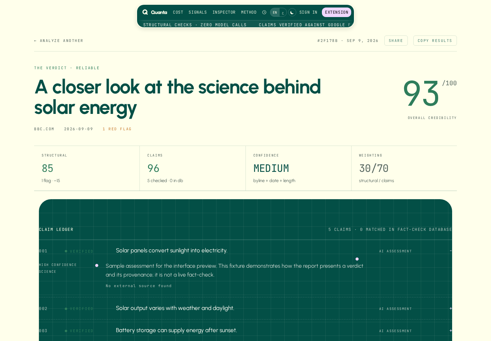

<div align="center"><sub>A live <i>Guardian</i> article, measured — 91/100, one structural flag, five claims verified.</sub></div>

---

## The problem it solves

Most "AI fact-checkers" ask a language model whether an article is true and print the number it makes up. That number is unfalsifiable and often wrong.

Quanta is built the other way around:

| | |
|---|---|
| **Deterministic first** | Byline, publish date, TLD, ALL-CAPS ratio, exclamation density and length are computed in plain TypeScript — no model, no variance, no API cost. This alone is the whole free tier. |
| **Grounded second** | Claims are checked against the **Google Fact Check Tools API** — real verdicts from PolitiFact, FactCheck.org, Full Fact, AFP — with **Brave Search** as a fallback. Every verdict that came from a database links back to the publisher that issued it. |
| **Model last, and labelled** | The LLM only gets the final word on claims that no fact-checker has covered, and the UI marks those cards `AI assessment` instead of `Fact-check database`. The prompt is explicitly instructed to answer `UNVERIFIED` rather than guess. |

The score is arithmetic over those verdicts, not a vibe. You can read the formula in [`lib/analyze.ts`](lib/analyze.ts) and reproduce it by hand.

---

## See it work

### 1 · Paste a URL or the article text

The archive on the right is every pass you've run, kept in `localStorage` — no account needed, and the history never leaves the browser.

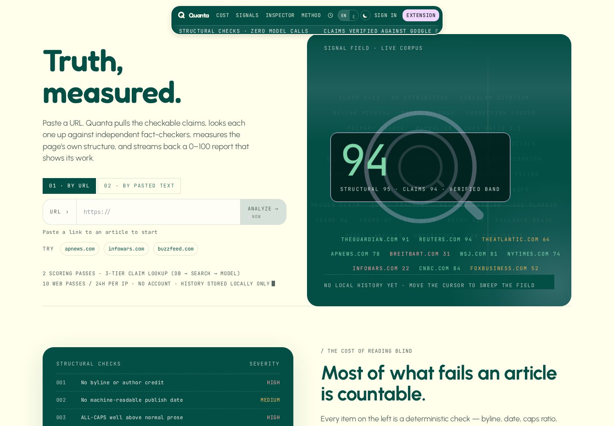

### 2 · Watch it think

The API is a **Server-Sent Events** stream, so the UI names each step as the server reaches it — including one line per claim being verified. Nothing is a fake progress bar; step `06` is genuinely the sixth frame off the wire.

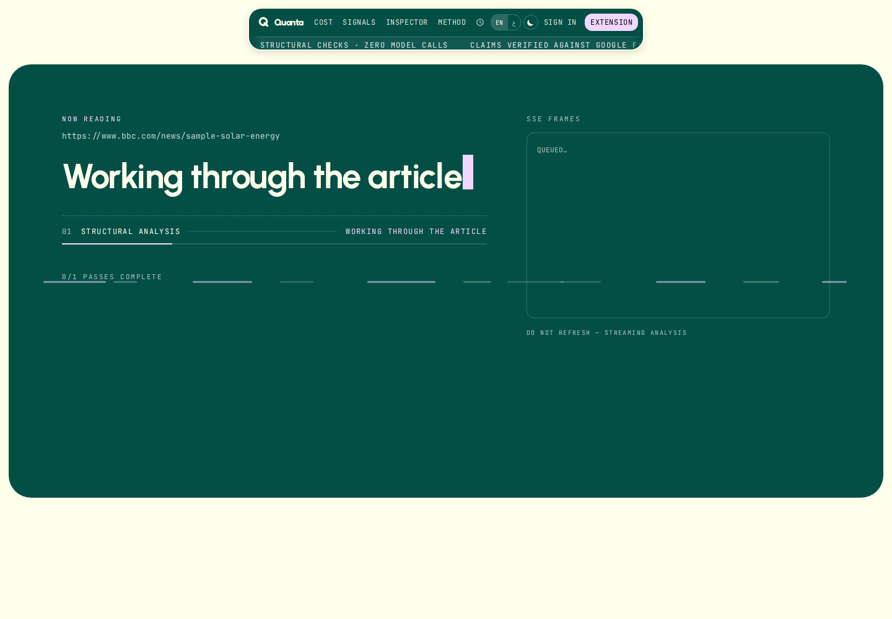

### 3 · Read the verdict

The report at the top of this page scored a *Guardian* piece at 91. Here is the same pipeline over a deliberately fabricated tabloid text: 40/100, four structural flags, four false claims — two of them matched directly against fact-check databases.

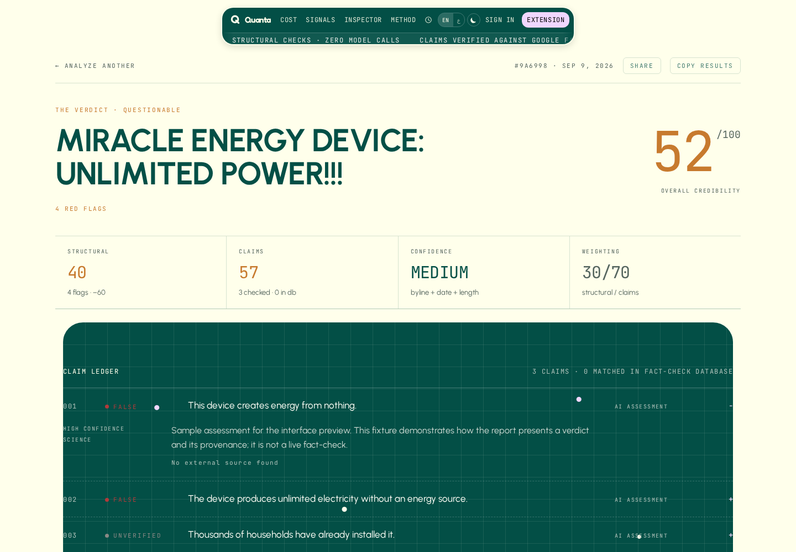

### 4 · Every claim, with its receipt

This is the part that matters. Each claim carries a verdict, a confidence, the publisher that issued the rating, a link to the original fact-check, and an honest `No external source found` marker when the assessment came from the model instead.

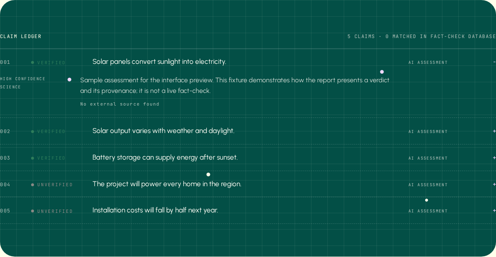

### 5 · Structural signals, computed not guessed

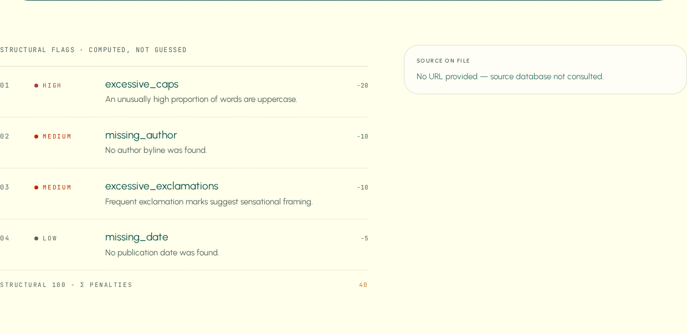

### 6 · In the dark

The whole interface is painted from CSS custom properties, so dark mode is a token swap in one stylesheet rather than a second set of components. An inline script applies the stored preference before first paint, so there's no white flash on load.

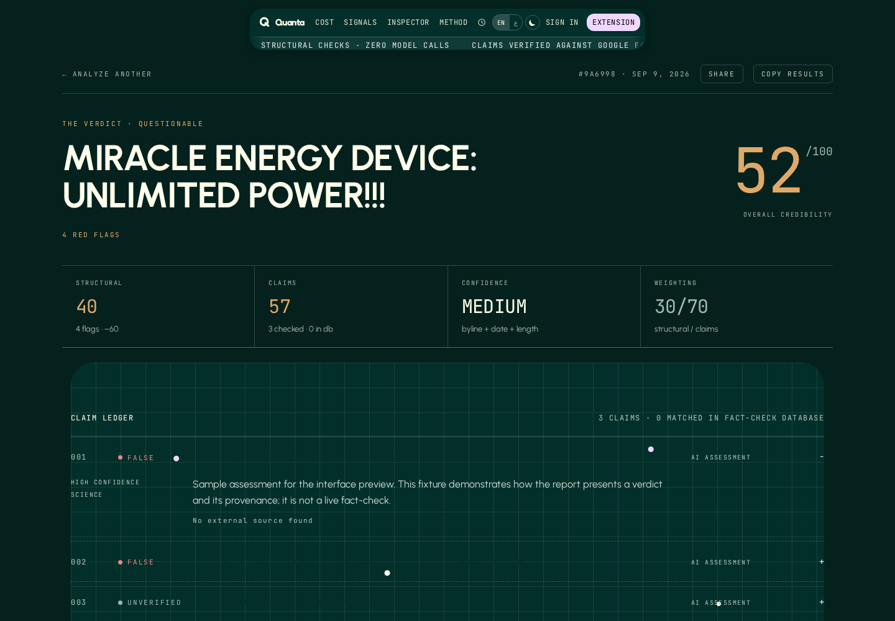

### 7 · Source dossier

32 outlets are profiled locally — credibility score, editorial lean, track record, and the standing fact-checker note. Unknown domains degrade gracefully to "source database not consulted" rather than inventing a rating.

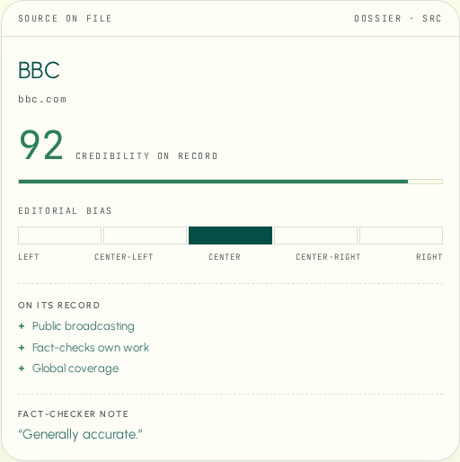

> *The full-length version of a report is [here](docs/screenshots/report-low-full.png).*

---

## The Chrome extension

Same engine, measured against whatever tab you're on. Mozilla **Readability** extracts the article in a content script, the popup drives the run, and an **MV3 service worker** holds the SSE connection — so the analysis survives the popup being closed, which is the thing MV3 popups are notorious for breaking.

<table>
<tr>
<td width="33%">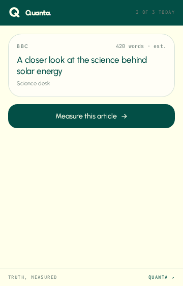</td>
<td width="33%">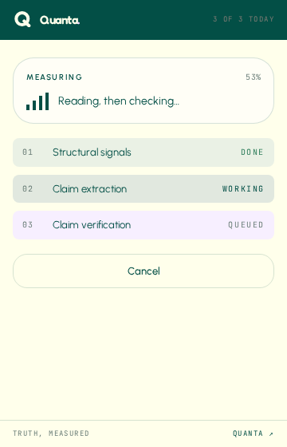</td>
<td width="33%">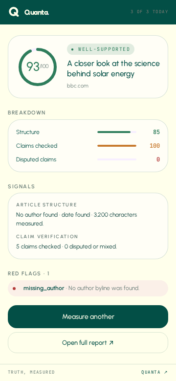</td>
</tr>
<tr>
<td align="center"><sub><b>Detect</b> — Readability finds the article on the current tab</sub></td>
<td align="center"><sub><b>Measure</b> — live steps proxied through the service worker</sub></td>
<td align="center"><sub><b>Report</b> — score, breakdown, signals, red flags</sub></td>
</tr>
</table>

---

## Landing page

A separate marketing surface at [`/landing`](https://factnews-six.vercel.app/landing), sharing the app's type system and design tokens.

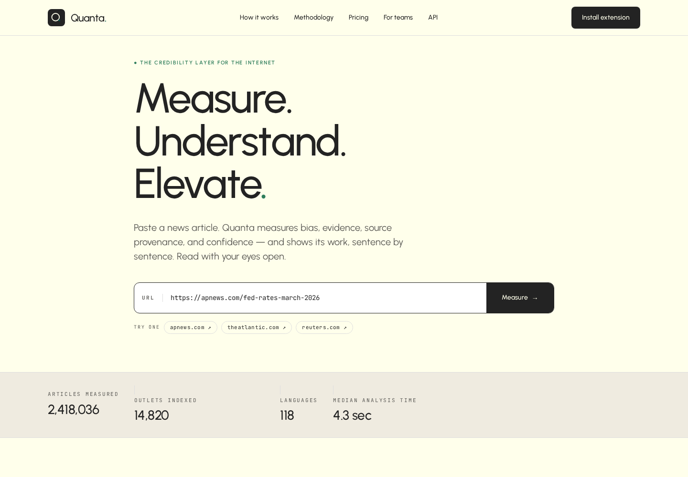

<sub>The figures in the trust strip are illustrative placeholder copy, not live metrics.</sub>

---

## How the analysis works

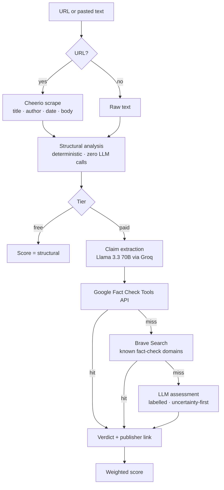

Every arrow above is one SSE frame to the client.

### Scoring

```
structural:  100 − Σ penalties          high = 20 · medium = 10 · low = 5
claims:      100 − mean(verdict penalty) FALSE 60 · MISLEADING 40 · MIXED 20
                                         UNVERIFIED 10 · TRUE 0

free   →  structural
paid   →  structural × 0.3  +  claims × 0.7
```

Structural weight is deliberately low: a well-formatted lie should not outscore a scruffy truth.

---

## Architecture

```
app/api/analyze/route.ts   SSE endpoint · CORS · rate limit · scrape → stream
lib/structural.ts          deterministic signals          (no network)
lib/groq.ts                shared LLM client              (retry, fence + JSON recovery)
lib/claims.ts              claim extraction               (Groq)
lib/factcheck.ts           Google Fact Check → Brave      (graceful null on miss)
lib/analyze.ts             async generator orchestrating the passes
lib/synthesize.ts          last-resort model assessment   (Groq, never throws)
lib/sourceDatabase.ts      32 outlets: score, lean, record
components/                report UI · claim cards · history · marketing
extension/                 MV3: content script · service worker · popup
```

Each of `structural`, `claims`, `factcheck` and `synthesize` is a pure module with one job, and `analyze.ts` is an `AsyncGenerator` that yields typed frames — which is why the same engine drives the web UI and the extension without a second code path.

### Extension IPC

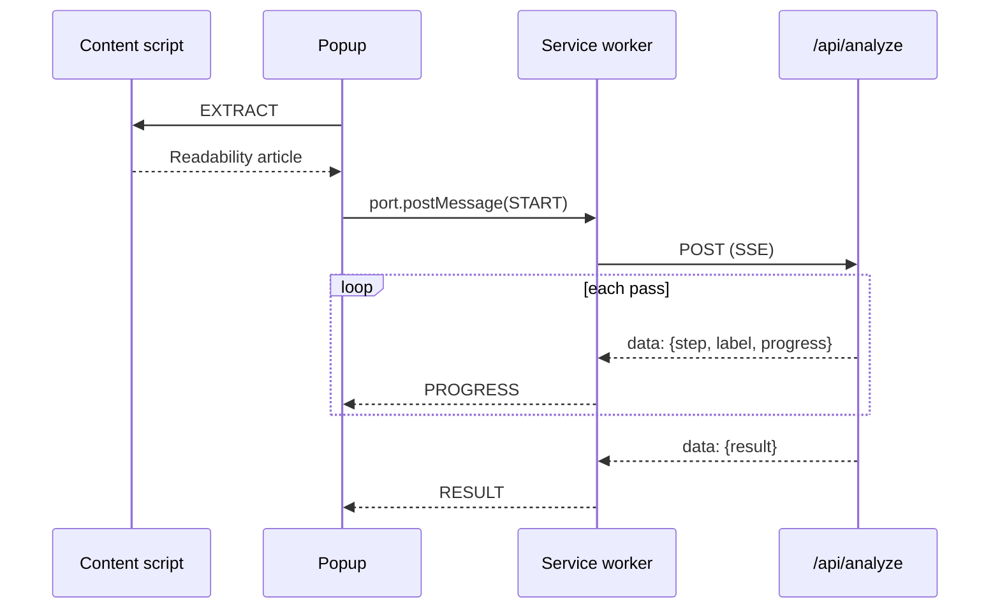

The long-lived `chrome.runtime.Port` lives in the service worker on purpose: MV3 kills the popup on blur, and a `fetch` started there dies with it.

---

## Engineering decisions worth reading

- **SSE, not WebSockets.** The stream is one-directional and the deployment target is Vercel serverless. A `ReadableStream` response needs no upgrade handshake, no connection state, no extra infrastructure.
- **An `AsyncGenerator` as the analysis contract.** The pipeline yields `{type:'step'}` and `{type:'result'}` frames; the route just serialises them. Adding a pass changes one file, and the tests iterate the generator directly without touching HTTP.
- **Every external service degrades into the next one.** No `GOOGLE_FACT_CHECK_API_KEY` → the lookup returns `null` and the chain falls through to Brave, then to the model. No Upstash → rate limiting falls back to an in-process `Map`. Missing keys quietly reduce the depth of the analysis instead of breaking the request.
- **Transient upstream failures don't sink the run.** Groq calls retry with backoff on 429/5xx and network errors, honouring `Retry-After`; a claim whose assessment can't be parsed degrades to `UNVERIFIED` rather than failing the whole report.
- **Prompts that are allowed to say "I don't know."** The synthesis prompt mandates `UNVERIFIED` with low confidence over a guess, and forbids fabricated citations — the failure mode that makes most LLM fact-checkers useless.
- **Provenance is a first-class field.** `source: 'factcheck_db' | 'web_search' | 'llm_assessment'` travels with every verdict all the way into the UI, so a reader always knows whether a claim was checked or merely assessed.
- **The extension's service worker inlines its constants.** Chrome MV3 module service workers can fail registration (`Status code: 2`) when imports cross generated chunk boundaries — a real bug hit and fixed here, documented in the file.
- **A caller-supplied URL is treated as an attack surface.** The endpoint fetches whatever URL it is handed from inside the deployment and returns the body, so `lib/urlGuard.ts` rejects non-http schemes, private and link-local addresses (including IPv4-mapped IPv6), and hostnames whose DNS answers point anywhere internal. Redirects are followed by hand so every hop is re-checked.
- **The quota is refunded when the work never happened.** Validation runs before a slot is claimed; the scrape runs after, and a dead link or a paywall hands the slot back rather than costing one of three daily analyses.
- **Errors carry a code, not a stack.** Failures travel as a typed `code` plus a fallback sentence; each client renders its own translated copy, and internal strings never reach the screen.

---

## Also in the box

- **Rate limiting** — every request: 3 analyses per 24h per extension install, 10 per 24h per IP, backed by Upstash Redis with an in-memory fallback
- **Dark mode** — a full token palette, a toggle in the nav, and a pre-paint script so the theme never flashes
- **English + Arabic** — message catalogues with a language selector, a persisted choice, and `lang`/`dir` on the document root
- **Local history** — version-guarded, so reports written by the previous scoring engine are discarded rather than mis-rendered
- **SEO** — OG image, `sitemap.ts`, `robots.ts`, full Open Graph and Twitter metadata
- **Tests** — 112 Vitest cases: the analysis generator (free/paid frames, verdict scoring, missing-key failure), the Groq client (retry on 429 and network error, no retry on 4xx, fence stripping, JSON recovery), structural scoring, verdict normalisation, the SSRF guard, the scraper, and the route end to end (validation, streaming, rate-limit buckets, quota refunds)

---

## Run it locally

```bash
npm install
cp .env.local.example .env.local     # add keys — all of them optional except Groq
npm run dev                          # http://localhost:3000
npm test                             # vitest
npm run check                        # typecheck + lint + test
```

| Variable | Needed for | Without it |
|---|---|---|
| `GROQ_API_KEY` | claim extraction + synthesis | free tier still works; paid tier errors |
| `GOOGLE_FACT_CHECK_API_KEY` | grounded verdicts w/ publisher links | falls through to Brave |
| `BRAVE_SEARCH_API_KEY` | fallback fact-check search | falls through to the model |
| `UPSTASH_REDIS_REST_URL` / `_TOKEN` | rate limits that survive a deploy | in-memory `Map` |

### Extension

```bash
cd extension && npm install && npm run build
```

Load `extension/dist` at `chrome://extensions` with Developer Mode on. To point it at a local server, uncomment `API_BASE_URL` in [`extension/src/lib/config.ts`](extension/src/lib/config.ts) and add the origin to `host_permissions` in [`extension/manifest.json`](extension/manifest.json).

---

## Honest limitations

This is a working prototype, not a finished product. Where it falls short:

- **There is still no auth.** The tier is now decided server-side in `resolveTier()` instead of being read off the request body, but that function returns `paid` for everyone — the rate limit, not a subscription, is what bounds usage.
- **The score is uncalibrated.** The weights are reasoned, not fitted. They need a labelled evaluation set before anyone treats the number as authoritative.
- **The source database is a hand-curated file.** 32 outlets, no update mechanism.
- **No persistence.** History is `localStorage`; clearing the browser clears the record.
- **Scraping fails on hard targets.** Paywalls, heavy JS, bot protection.
- **The marketing landing page uses illustrative figures**, not live product metrics.
- **Quanta is a reading aid, not an oracle.** It is at its most useful when it disagrees with your first instinct and shows you why.

## Roadmap

`Auth + real tier gating` · `Server-side history and shareable report URLs` · `Calibration against a labelled set` · `Firefox / Safari builds` · `Error tracking` · `Public API`

---

<div align="center">

Built with Next.js, TypeScript and Groq · MIT licensed

<sub>Every report screenshot above is a real analysis of a live article, captured from the running app.</sub>

</div>
